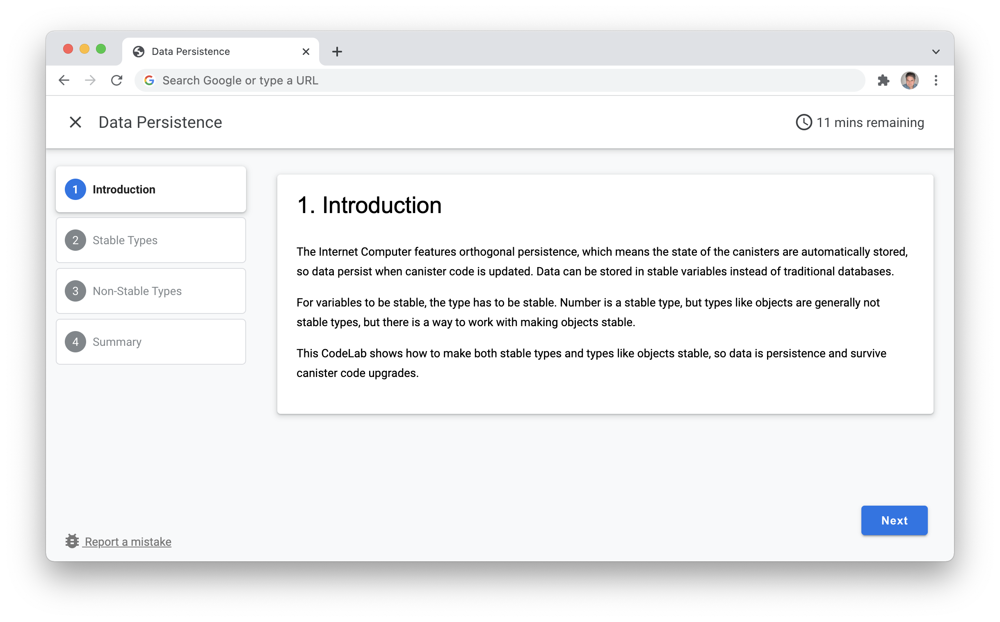

# DFINITY CodeLabs



## How to create a CodeLab
CodeLab is an open source project from Google, and the command line tool `claat` converts Markdown files to user friendly step-by-step guides. See some exambles [here](https://codelabs.developers.google.com).

### Install the tool
The command line tool `claat` (CodeLab as a thing) must be installed first, and there is a good description of how to install the tool in [here](https://github.com/googlecodelabs/tools/tree/main/claat). The tool can either be downloaded as an executable or build it from source.

### Create your first CodeLab
CodeLabs use Markdown, so creating a CodeLab is easy if you are used to creating GitHub README files. The main difference is the header information. 

The Markdown file for a CodeLab must have header like this:
``` 
author: DFINITY
summary: Minimal dapp for the Internet Computer
id: minimal_rust_dapp
categories: codelab,markdown
environments: Web
status: Published
feedback link: https://github.com/dfinity/docs
```

The header information is used to configure the CodeLab
- **summary**: Name in the header
- **id**: Folder name of compiled CodeLab
- **feedback link**: URL used in the bug report link in the bottom left corner

**Steps**

The steps in the CodeLab is defined by `##` headings. In the screenshot above, the name in the navigation on the left side, and the heading in the content section in the middle, are defined by the `##` heading. 

The first step in the screenshot looks like this in markdown code:

```
## Introduction
Duration: 0:01:00

The Internet Computer features orthogonal persistence, which means the state of the canisters are automatically stored, so data persist when canister code is updated. Data can be stored in stable variables instead of traditional databases. 
...
```

**Time remaining**

The time remaining in the CodeLab header is calculated based on the duration specified in each step. By adding this line under the step header, the duration of the step is set to 1 minute and added to the total shown in the CodeLab header:

```
Duration: 0:01:00
```

The duration line in the markup will not be visible in the step content.

**Examples**

See the CodeLabs in this repo for learning how to write your own CodeLab, and for inspiration to how to structure the CodeLab content.

## Build the CodeLab
Use the `claat` tool to compile the CodeLab from the markdown file. From the directory where the markdown file is located, run this command:

```sh
$ claat export codelab_name.md
```

A folder will be created with the compiled CodeLab project, containing HTML, configuration and images if any are used. The CodeLab is now compiled to a static HTML page.

## Run CodeLabs locally
To run the CodeLabs locally, clone the repo, go to a CodeLab (e.g. docs/codelabs/static-website/static_website) and run this command:

```sh
npx http-server
```
or 
```sh
claat serve
```

## Commit your CodeLab
When the CodeLab is created and tested locally, it can be committed to this GitHub repo as a pull request. Please provide the following in a folder under `docs/codelabs` with the name of the CodeLab, e.g. `codelab-name`:

- **code** - if the CodeLab is based on a code example, provide the project in a folder called _code_
- **codelab_name** - provide the compiled CodeLab files as generated by the `claat` tool
- **markdown_file.md** - provide the markdown file

See existing CodeLabs to see how the files and folders are organized. Please keep this file structure as automated builds will expect this structure.
