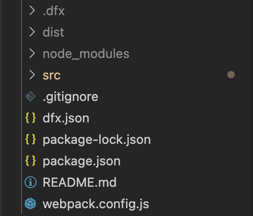
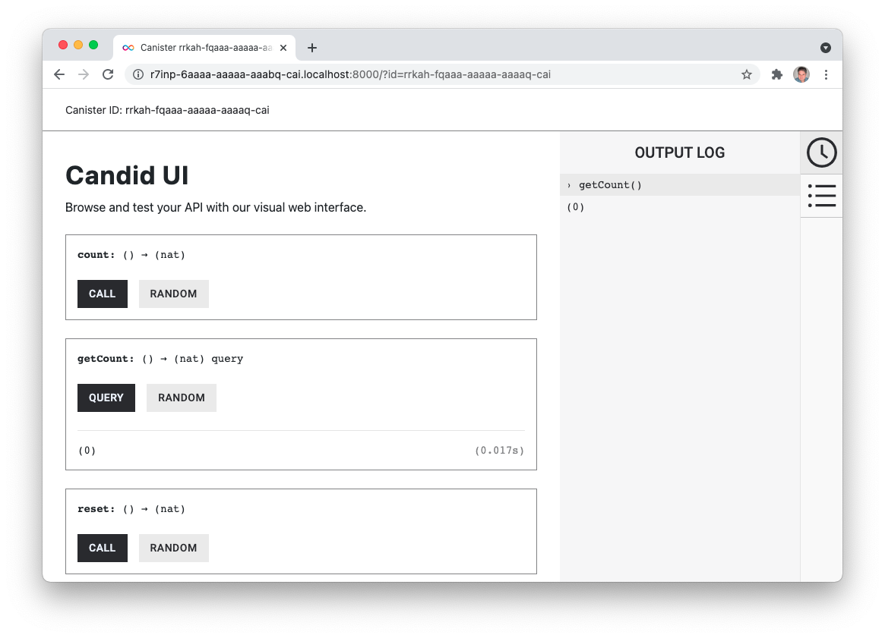

author: DFINITY
summary: Minimal dapp for the Internet Computer
id: minimal_motoko_dapp
categories: codelab,markdown
environments: Web
status: Published
feedback link: https://github.com/dfinity/docs

# Minimalistic Motoko Dapp

## Introduction
Duration: 0:01:00

This CodeLab shows how to build a minimalistic dapp based on the default dapp template installed by DFX when creating a new project. The dapp is a simple website with a counter. Every time a button is pressed, a counter is incremented. 

This CodeLab covers:

- Create new canister smart contract using the SDK (DFX)
- Use the default project as a template as the starting point for the new project
- Add backend functions for a counter (count, get count and reset count)
- Implement backend functions in the frontend
- Deploy the canister smart contract locally
- Test backend with Candid UI and command line using DFX, and test frontend in browser 

The frontend will look like this:


## Create New Project
Duration: 0:03:00

Run this command to create project:

```bash
$ dfx new minimal_dapp
```

DFX will create a new directory called *minimal_dapp*, and in this directory you will find all the files, both frontend, backend, configurations etc. for the default project. The default project can be deployed without any changes as it is.



The `src` directory will contain the default frontend and backend code.

The `dfx.json` file contains the canister configuration. It defines the canister(s), where the source code for the canister(s) is located, the type of canister(s) and which version of DFX the project was created with. 

## Modify the Backend
Duration: 0:05:00

As the first step, add a few backend functions. The backend functions are located in the `src/minimal_dapp/main.mo` Motoko file.

The existing code from the default project is not needed, so the greet() function is deleted.

```javascript
actor {

}
```

### Counter variable
Three functions are created to make the counter work: count(), getCount() and reset(). The current counter value is stored as a number in the actor.


```javascript
actor {
    var counter : Nat = 0;
}
```

### count()
The `count()` function increments the counter variable. This function is envoked when the user is clicking the button on the frontend, or when the function is called through the Candid interface.

```javascript
public func count() : async Nat {
    counter += 1;
    return counter;
};
```

The function is returning the incremented counter variable.

### getCount()
The `getCount()` function returns the current counter value.

```javascript
public query func getCount() : async Nat {
    return counter;
};
```

### reset()
The `reset()` function resets the counter value to 0 and returns the value.

```javascript
public func reset() : async Nat {
    counter := 0;
    return counter;
};
```

### The completed backend file
The `main.mo` file looks like this when it's all put together:

```javascript
actor {
    
    var counter : Nat = 0;

    public func count() : async Nat {
        counter += 1;
        return counter;
    };

    public query func getCount() : async Nat {
        return counter;
    };
    
    public func reset() : async Nat {
        counter := 0;
        return counter;
    };
};
```

## Test the Backend
Duration: 0:07:00

At this point the backend can be deployed and its functionality can be tested. The backend can be tested in different ways, and in this step the backend is tested by making requests through DFX calls and by using the web interface created by Candid.

### Deploy canisters
First the dapp has to be deployed, which is done locally for this CodeLab. The local network is started by running this command:

```bash
$ dfx start --background
```

When the local network is up and running, run this command to deploy the canisters:

```bash
$ dfx deploy
```

### DFX
DFX has a subset of commands for canister operations, and one of them enables calling the public functions added to the `main.mo` file in the previous step. In the following examples the initial value is 0. `count` will increment value and return 1, `getCount` will return the current value and `reset` will set the value to 0.

Command usage: `dfx canister call &#60project&#62  &#60function&#62`

```bash
$ dfx canister call minimal_dapp count
(1 : Nat)
```

```bash
$ dfx canister call minimal_dapp getCount
(1 : Nat)
```

```bash
$ dfx canister call minimal_dapp reset
(0 : Nat)
```

### Candid UI
The Candid UI provides an easy, user friendly interface for testing the backend. The UI is automatically generated, and the canister ID can be found in the `canister_ids.json` file. 

The localhost version of the `canister_ids.json` file can be found in `.dfx/local/canister_ids.json` and the URL is: 

**http://<candid_canister_id>.localhost:8000/?id=<backend_canister_id>**



## Modify the Frontend
Duration: 0:05:00

The default project has an `index.html` file with page HTML and an `index.js` file with an implementation of the backend functions.

### HTML
For this CodeLab the changes to the `index.html` file is minor. The button is kept and so is the section showing the result, just simplified.

```html
<!doctype html>
<html lang="en">
    <head>
        <meta charset="UTF-8">
        <meta name="viewport" content="width=device-width">
        <title>hack</title>
        <base href="/">

        <link type="text/css" rel="stylesheet" href="main.css" />
    </head>
    <body>
        
        <section>
            <button id="clickMeBtn">Click Me!</button>
        </section>
        <section id="counter"></section>
    </body>
</html>
```

### Javascript
The existing event listener for button click is modified to call the `count()` function, and an event listener for page load is added to get the initial value of the counter with `getCount()`. The backend functions are still imported through the Candid interface.

```javascript
import { minimaldapp } from "../../declarations/minimal_dapp";

document.addEventListener('DOMContentLoaded', async function () {
  const counter = await minimaldapp.getCount();
  document.getElementById("counter").innerText = "Counter: " + counter;
})

document.getElementById("clickMeBtn").addEventListener("click", async () => {
  const counter = await minimaldapp.count();
  document.getElementById("counter").innerText = "Counter: " + counter;
});
```

## Test the Frontend
Duration: 0:03:00

The canisters must be re-deployed since the frontend has changed since the deployment of the backend changes in step . Assuming the local network is still running, re-deploy with this command:

```bash
$ dfx deploy
```

The URL for the frontend is depending on the canister ID. As described step 4, get the canister ID, the UI canister in this case, from the canister_IDs.json file. The URL will look like this:

**https://<ui_canister_id>.localhost:8000**


## Summary
Duration: 0:01:00

This CodeLab walks through the very basic steps of creating and deploying a dapp locally, using Motoko and HTML/Javascript. 

For information about deploying the dapp to the Internet Computer, see the documentation [here](https://smartcontracts.org/docs/quickstart/network-quickstart.html).