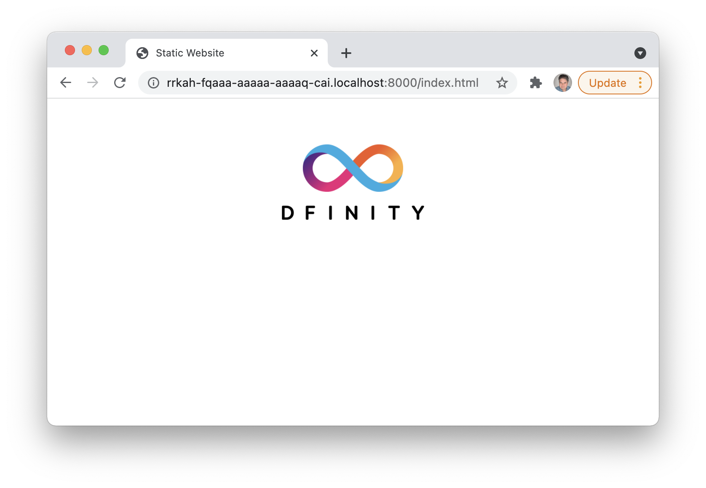

author: DFINITY
summary: Static Website on the Internet Computer
id: static_website
categories: codelab,markdown
environments: Web
status: Published
feedback link: https://github.com/dfinity/docs

# Static Website on the Internet Computer

## Introduction
Duration: 0:01:00

This CodeLab shows how to build a minimalistic, static website and deploy it on the Internet Computer. Since this is a very simple project, without any backend, most of the files the default project comes with when running `dfx new ...` is not needed, and therefore this project is created manually with only the needed files.



## Creating the Website
Duration: 0:04:00

The website is really simple, it consists of a HTML file, CSS file and a PNG file. All it does is displaying a logo on the website, but the idea would be the same for more advanced static websites.

The content of the HTML and CSS files:

### HTML
```html
<!doctype html>
<html lang="en">
    <head>
        <meta charset="UTF-8">
        <meta name="viewport" content="width=device-width">
        <title>Static Website</title>
        <base href="/">
        <link type="text/css" rel="stylesheet" href="styles.css" />
    </head>
    <body>
        
    </body>
</html>
```

### CSS
```css
img {
    max-width: 50vw;
    max-height: 25vw;
    display: block;
    margin: auto;
}
```

### File Structure
The file structure can look like this, where assets and source code is separated:

```bash
└── assets
    ├── assets
    │   └── styles.css
    │   └── logo.png
    └── src
        └── index.html             
```

## Create dfx.json
Duration: 0:03:00

The dfx.json file is a configuration file which specifies the canister(s) used for the dapp. In this case only one canister is needed, and besides the canister configuration, `dfx.json` also includes information about DFX version, build settings and network settings. 

```json
{
    "canisters": {
        "www": {
            "frontend": {
                "entrypoint": "assets/src/index.html"
            },
            "source": [
                "assets/assets",
                "assets/src"
            ],
            "type": "assets"
        } 
    },
    "defaults": {
        "build": {
            "args": "",
            "packtool": ""
        }
    },
    "dfx": "0.8.3",
    "networks": {
        "local": {
            "bind": "127.0.0.1:8000",
            "type": "ephemeral"
        }
    },
    "version": 1
}
```

## Deploy Locally
Duration: 0:03:00

First the local network has to be started, and it is started by running this command:

```bash
$ dfx start --background
```

When the local network is up and running, run this command to deploy the canisters:

```bash
$ dfx deploy
```

To go to the deployed website, the canister ID is needed. The canister ID is shown in the output from the deployment, but it can alse be found in the `canister_ids.json` file. 

The localhost version of the `canister_ids.json` file can be found in `.dfx/local/canister_ids.json` and the URL for the website is: 

**http://<canister_id>.localhost:8000**

## Deploy on the IC
Duration: 0:02:00

Deploying the website to the IC is not very different from deploying locally. The command `dfx deploy` is also used for deployment on the IC, but with the added network parameter:

```bash
$ dfx deploy --network ic
```

The canister must have cycles assigned in order to deploy, see how to add cycles to the canister in the documentation [here](https://smartcontracts.org/docs/quickstart/network-quickstart.html).
