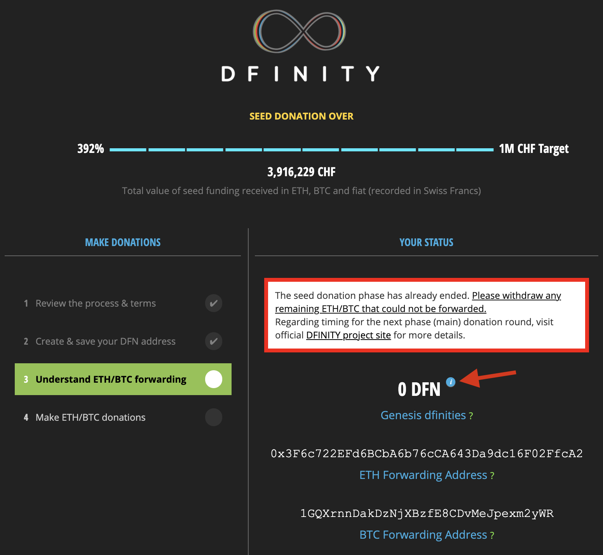
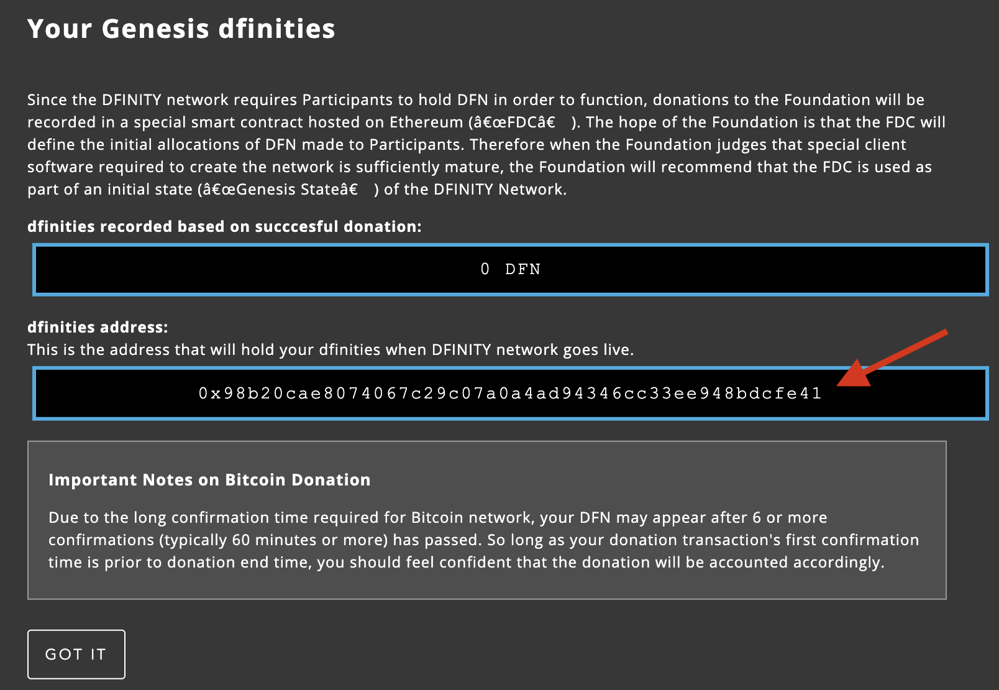
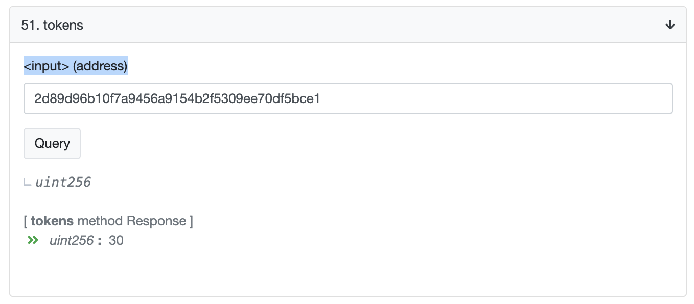

= Neuron/ICP Instructions for Seed Participants
:experimental:
// Define unicode for Apple Command key.
:commandkey: &#8984;
:IC: Internet Computer
:company-id: DFINITY
ifdef::env-github,env-browser[:outfilesuffix:.adoc]

THANK YOU for being a Seed participant.

You have been granted ICP at a rate of 30 tokens per Swiss Franc of value donated in 2017, which Genesis Unlock is disbursing in the form of a basket of 49 voting neurons.

These neurons already exist inside the Network Nervous System, the completely open, tokenized governance system that controls the Internet Computer blockchain network. Your neurons contain the ICP you have been awarded, staked inside. Your neurons have been configured to vote automatically and are already earning voting rewards for you. You do not need to do anything to initialize your neurons in order to continue earning voting rewards.

A neuron is like a savings account where you must provide notice of withdrawals. The configured notice period is called the “dissolve delay”. You can start and stop dissolving a neuron at any time. The greater the dissolve delay, the greater the neuron’s voting power, and the greater the voting rewards it receives.

We are pleased to inform you that your neurons have been pre-aged! At the moment of Genesis Unlock, their age was already set to 18 months old. This is important, because neuron age significantly increases your voting power and the voting rewards you receive.

WARNING: When you start dissolving a neuron, the blockchain will reset its age to zero immediately. Therefore, be very careful to only begin dissolving neurons when you wish to unstake the ICP inside.

Genesis Unlock created 49 neurons for you. They have dissolve delays of 0 days, 30 days, 60 days, 90 days and so on. Apart from the first neuron which has a dissolve delay of 0 days (which can be dissolved immediately), the other dissolve delays may have a small random number of days either added or removed.

To configure one of your neurons, for example to change how it votes, or to place it into dissolving mode, follow these steps:

WARNING: This process is not currently possible on macOS computers with M1 chips. You can only install the {sdk-short-name} `+dfx+` and the Candid compiler `+didc+` on Intel-based macOS and Linux computers.

. <<Derive a native Internet Computer principal from your Ethereum seed>>
. <<Take control of your neurons>>
. <<Enable disbursal by passing the KYC process>>
. <<Instruct the neurons you wish to unstake to dissolve>>
. <<Disburse ICP from neurons that are fully dissolved>>

== Derive a native Internet Computer principal from your Ethereum seed

As an early contributor or seed donor, you wrote down a 12-word mnemonic seed phrase that was generated by the DFINITY Chrome extension. To create an identity, you must derive a private key from your seed phrase and import that private key into the DFINITY Canister SDK. This step is required before you can <<Take control of your neurons>>.

=== Secure your environment

The safety and security of your private key is your responsibility and there is no substitute for planning ahead, bringing the right equipment, having the right skills, and using good judgment. We strongly recommend you proceed using an *air-gapped computer* to reduce the risk of having your private key compromised. Depending on the hardware available, you might want to physically remove your network controller, microphone, speakers, and other components, or disable them in your BIOS. Covert channels can be established through a variety of different mediums, including sound, light, radio-frequency, and physical media. Be sure to evaluate the capabilities of your system before settling on a configuration that makes sense for you. If you don’t know what you are doing, you should consult with a computer security expert. Do not contact the DFINITY Foundation for help with securing your environment.

=== Install Keysmith

You need link:https://github.com/dfinity/keysmith[Keysmith] to derive your private/public key pair from you seed phrase.

To install Keysmith, you must either <<Fetch the release binary>> or <<Build Keysmith from source>>.

==== Fetch the release binary

If you want to download the Keysmith release binary, keep in mind that you must perform this action on a computer with a network connection. If you are using an air-gapped computer, then you must copy the release binary from your networked computer to your air-gapped computer. How you do this will depend on your configuration.

To download the Keysmith release binary, fetch release link:https://github.com/dfinity/keysmith/releases/tag/v1.5.0[v1.5.0] from Github.

Keysmith supports the following operating systems and architectures:

- Darwin / AMD64 – for macOS models with an Intel chip (link:https://www.howtogeek.com/706226/how-to-check-if-your-mac-is-using-an-intel-or-apple-silicon-processor/#:~:text=Here%2C%20you'll%20find%20the,Mac%20with%20an%20Intel%20chip.[how to check])
- Darwin / ARM64 – for newer macOS models with an M1 chip (link:https://www.howtogeek.com/706226/how-to-check-if-your-mac-is-using-an-intel-or-apple-silicon-processor/#:~:text=Here%2C%20you'll%20find%20the,Mac%20with%20an%20Intel%20chip.[how to check])
- Linux / AMD64
- Linux / ARM32
- Linux / ARM64
- Windows / AMD64

Download the `.tar.gz` file matching your architecture and operating system.
If you have a newer M1-based macOS, download `keysmith-darwin-arm64.tar.gz`.
Although you can install `+keysmith+` on macOS computers with an M1 chip, you can only install the {sdk-short-name} `+dfx+` command-line interface on Intel-based macOS computers.
For an Intel-based macOS, download `keysmith-darwin-amd64.tar.gz`.

==== Verify the SHA256 checksum of your download

Open a terminal and change to the download directory. On a Mac this is

[source,bash]
----
cd ~/Downloads
----

Compute the SHA256 checksum of your download.

[source,bash]
----
openssl dgst -sha256 keysmith-*.tar*
----

Make sure the output matches one of the following lines:

....
SHA256(keysmith-darwin-amd64.tar.gz)= ad7383d60bced19580fa37b77e133b1e80416b482e4c5326ac2fd17a7710a318
SHA256(keysmith-darwin-arm64.tar.gz)= da1a4ac5ae04b85d4c5b0a3deb6442fb7c456dcf97cbd6ff8153316c5dbb29a9
SHA256(keysmith-linux-amd64.tar.gz)= 7901c3a23aef298f930d1dddf8eee23bc51a55ffda670accfd7b9e37748913d8
SHA256(keysmith-linux-arm32.tar.gz)= 0ab44e74cc502aa653dcb28962bcada5cbefb9e0ec41853a03fb4745c5cd51a9
SHA256(keysmith-linux-arm64.tar.gz)= 635c0bf98dd15f27b302ec0ea793f75c797441009c74500bd9d0a5df26092264
SHA256(keysmith-windows-amd64.tar.gz)= cb398c39583b81d5170dd0a9539d902715317572f6a640b45d3d2db01946b8fa
....

If your browser already unzipped the `.tar.gz` for you and you have a file ending in `.tar` then make sure the output of `openssl` matches one of the following lines:

....
SHA256(keysmith-darwin-amd64.tar)= 97b8048f00e75d6adc8651aac1aa77d9bd9c150b0dbc0b0f6409f0d6bdbb24a4
SHA256(keysmith-darwin-arm64.tar)= 07e296fbf33b0c06bd04a8ead30487762aa30ca2daf7e19948d74a96f2c34067
SHA256(keysmith-linux-amd64.tar)= 1d2d986a971f8c7ef0eeb4b01624f023ef8dc9c71d2f0127f21fcc99aebdc99a
SHA256(keysmith-linux-arm32.tar)= 8eb8efecd9182822326f2e60fcff32c0b1541cce206a12b3f2e94547c66dfe63
SHA256(keysmith-linux-arm64.tar)= 82264487e83cbfdd758c1227375758b7d1f0c864adb555775777e7d3afa19e08
SHA256(keysmith-windows-amd64.tar)= b85224d4e9807b8335295193c12dd0cab22bd38881d14c1f1c21479801ace17d
....

==== Unpack and install keysmith

To extract the executable from the tarball, enter the following command into your terminal:

[source,bash]
----
tar -f keysmith-*.tar* -x
----

Next, add the executable to your PATH by entering the commands below:

[source,bash]
----
sudo install -d /usr/local/bin
sudo install keysmith /usr/local/bin
----

You will be prompted to enter your laptop password.
The password itself will not appear, simply type it and press enter.

==== Run it

[source,bash]
----
keysmith
----

You should see:

....
usage: keysmith <command> [<args>]

Available Commands:
    account             Print your account identifier.
    generate            Generate your mnemonic seed.
    legacy-address      Print your legacy address.
    principal           Print your principal identifier.
    private-key         Write your private key to a file.
    public-key          Print your public key.
    version             Print the version number.
    x-public-key        Print your extended public key.
....

If you are using macOS, making the `+keysmith+` binary executable might require you to change a permission setting using System Preferences > Security & Privacy > General.

==== Build Keysmith from source

If you want to build the Keysmith from source, keep in mind that you must perform this action on a computer with a network connection. If you are using an air-gapped computer, then you must copy the target binary from your networked computer to your air-gapped computer. How you do this will depend on your configuration.

Keysmith is written in link:https://golang.org[Go], so if you choose to build it from source, then you must first link:https://golang.org/dl[download] and install Go, verify that `go` is in your `PATH`, and configure your `GOPATH` and `GOBIN` environment variables.

Run the following command to build Keysmith from source.

[source,bash]
----
go get github.com/dfinity/keysmith
----

=== Install the DFINITY Canister SDK

You can install the DFINITY Canister SDK by fetching the `v0.7.0` release binary from our link:https://sdk.dfinity.org[website]. It is not yet possible to build the DFINITY Canister SDK from source.
Note that this action can only be performed on a networked computer. If you are using an air-gapped computer, then you must copy the release binary from your networked computer to your air-gapped computer. How you do this will depend on your configuration.

Run the following command to install the DFINITY Canister SDK.

[source,bash]
----
sh -ci "$(curl -fsSL https://sdk.dfinity.org/install.sh)"
----

*Warning: Note that `dfx` will currently not install on M1-based Macs.*

=== Set your seed phrase for use with keysmith

Once you have installed Keysmith and the DFINITY Canister SDK, and you are [.underline]#confident that your environment is secure#, then you are ready to enter your seed for use with `keysmith`.
For the duration of your session, you store your seed phrase in an environment variable.
It will be eliminated from your system when you turn your computer off.

[source,bash]
----
read seed
----

Enter your seed phrase and finish with Return.

If you prefer to not have your seed phrase displayed as you type then use this command instead:

[source,bash]
----
read -s seed
----

=== Check your legacy address and balance (optional)

At this point you can already verify your legacy address and ICPT balance.
The legacy address matches to what was formerly called "DFN address" in the Dfinity Chrome extension.
You may have copied it from the Chrome extension for your records back when you used the extension.

[source,bash]
----
echo $seed | keysmith legacy-address -f -
----

The output is a 40 character hex string. It looks something like this:

....
2d89d96b10f7a9456a9154b2f5309ee70df5bce1
....

You can check your ICPT balance as follows:

[source,bash]
----
echo {} > dfx.json
GTC=renrk-eyaaa-aaaaa-aaada-cai
ADDR=$(echo $seed | keysmith legacy-address -f -)
dfx canister --network=https://ic0.app --no-wallet call $GTC balance '("'$ADDR'")'
----

The output is the number of ICPT associated with your address.

If you are an early contributor then you may have multiple addresses, all derived from your one seed phrase. To check the balance in each of them you do the following commands:

[source,bash]
----
GTC=renrk-eyaaa-aaaaa-aaada-cai
ADDR=$(echo $seed | keysmith legacy-address -f - -i 0)
dfx canister --network=https://ic0.app --no-wallet call $GTC balance '("'$ADDR'")'
----

Then you repeat the last two lines with `-i 1`, `-i 2`, etc.

=== Derive and import your private key

Derive your private key from your seed phrase.

[source,bash]
----
echo $seed | keysmith private-key -f -
----

This creates a file `identity.pem` containing your private key.
Import your private key(s) into the DFINITY Canister SDK and then remove it from the filesystem.

[source,bash]
----
dfx identity import <name> identity.pem
rm identity.pem
----

Here, <name> is an alias that you can choose arbitrarily for your identity, e.g. "jane".
The command above displays output similar to the following:

....
Creating identity: "jane".
Created identity: "jane".
....

Make your new identity the currently-active one.

[source,bash]
----
dfx identity use <name>
----

The command above displays output similar to the following:

....
Using identity: "jane".
....

At any time, you can list all available identities with

[source,bash]
----
dfx identity list
----

== Take control of your neurons

You will receive your tokens inside a set of neurons that have been pre-created for you.
The number of neurons will total 31 or 49 depending on whether you are an early contributor or seed donor, respectively.
Your tokens are disbursed equally over these neurons.
Claiming your neurons is the process of obtaining control over your neurons.
It is done for all neurons at once.

Your neurons differ by their dissolve delay.
For an explanation of dissolve delay see <<Instruct the neurons you wish to unstake to dissolve>> below.

To claim your neurons, you need to sign and send a message to the Genesis Token Canister. You can accomplish this in one step on a networked computer using `dfx canister call`, or as two separate steps, one on an air-gapped computer using `dfx canister sign`, and another on a networked computer using `dfx canister send`. We strongly recommend the latter approach to reduce the risk of having your private key compromised.

Regardless of which method you choose, you will need to download and install `didc`, the Candid compiler, on your networked computer. You can find the latest release link:https://github.com/dfinity/candid/releases[here]. Note that the binaries are suffixed by the operating systems they run on, `didc-linux64` and `didc-macos`. Be sure to download the correct one. Below are commands to install `didc` on `macos`. If your're using Linux, simply use the `linux64` suffix instead.

[source,bash]
----
sudo install -d /usr/local/bin
sudo install -m 0755 ~/Downloads/didc-macos /usr/local/bin/didc
----

Regardless of which method you choose, you will also need to download and extract the NNS canister interfaces on your networked computer. You can find the latest release link:https://github.com/dfinity/nns-ifaces/archive/refs/tags/v0.8.0.tar.gz[here]. Below are commands to extract the NNS canister interfaces.

[source,bash]
----
pushd ~/Downloads
tar -f nns-ifaces-0.8.0.tar.gz -x
popd
----

Additionally, you will need to have `dfx.json` file available in the directory from which you are running `dfx` commands. You can create an empty `dfx.json` file in your current directory by running the following command.

[source,bash]
----
echo {} > dfx.json
----

Note that if you're using an air-gapped computer, then you'll need to repeat this step since you'll be running `dfx` commands in both places.

After downloading and installing `didc`, downloading and extracting the NNS canister interfaces, and creating your `dfx.json` file(s), you can <<Claim in one step (not recommended)>> or <<Claim in two steps>>.

=== Claim in one step (not recommended)

Verify that you can connect to the Internet Computer.

[source,bash]
----
dfx ping https://ic0.app
----

Derive your public key.

[source,bash]
----
PUBLIC_KEY="$(echo $seed | keysmith public-key -f -)"
----

Call the Genesis Token Canister to claim your neurons.

[source,bash]
----
CANISTER=renrk-eyaaa-aaaaa-aaada-cai
RESULT="$(dfx canister --network=https://ic0.app --no-wallet call $CANISTER claim_neurons '("'$PUBLIC_KEY'")' --output=raw)"
didc decode -t "(Result)" -d ~/Downloads/nns-ifaces-0.8.0/genesis_token.did $RESULT
----

=== Claim in two steps

==== On your air-gapped computer

Derive your public key.

[source,bash]
----
PUBLIC_KEY="$(echo $seed | keysmith public-key -f -)"
----

Sign a message to claim your neurons.

Note that the time allotted to send a signed message is a fixed *5-minute window*. The `--expire-after` option enables you to specify the point in time when the 5-minute window for sending the signed message should end. For example, if you set the `--expire-after` option to one hour (`1h`), then you must wait at least 55 minutes before you send the generated message and the signature for the message is only valid during the 5-minute window ending in the 60th minute. Hence, you would need to send the message after 55 minutes and before 60 minutes for the message to be recognized as valid. If you don't specify the `--expire-after` option, then the default expiration is five minutes.

[source,bash]
----
CANISTER=renrk-eyaaa-aaaaa-aaada-cai
dfx canister --network=https://ic0.app --no-wallet sign --expire-after=1h $CANISTER claim_neurons '("'$PUBLIC_KEY'")'
----

The command above results in a `message.json` file in your current directory. You must copy that file from your air-gapped computer to your networked computer. How you do this will depend on your configuration.

==== On your networked computer

Verify that you can connect to the Internet Computer.

[source,bash]
----
dfx ping https://ic0.app
----

Send the signed message to the Genesis Token Canister to claim your neurons. As previously mentioned, you can only perform this action within the 5-minute window that you specified.

[source,bash]
----
dfx canister --network=https://ic0.app --no-wallet send message.json
----

Unlike `dfx canister call` in the section <<Claim in one step>>, the command `dfx canister send` does not return output that can be parsed by `didc`.
Instead, it outputs only a request id.

In order to see the effect of your `send` request, you have to do an additional step.
Perform the following commands on your networked machine:

[source,bash]
----
CANISTER=renrk-eyaaa-aaaaa-aaada-cai
RESULT="$(dfx canister --network=https://ic0.app --no-wallet call $CANISTER get_account '("paste legacy address here")' --output=raw)"
didc decode -t "(Result_2)" -d ~/Downloads/nns-ifaces-0.8.0/genesis_token.did $RESULT
----

The legacy address to paste here in the second line above is what was formerly called "DFN address" in the Chrome extension.
Note that the legacy address must be pasted without the `0x` prefix and without the 8-character checksum at the end, i.e. it has exactly 40 characters in length.
Furthermore, the legacy address must be in all lowercase.
If you don't remember it then you can obtain your legacy address by running this on your air-gapped machine:

[source,bash]
----
echo $seed | keysmith legacy-address -f -
----

What you want to look for in the output of the `get_account` request is `has_claimed = true` and your principal.
For example, the output of the `get_account` command looks like this for an unclaimed account:

....
(
  variant {
    Ok = record {
      authenticated_principal_id = null;
      successfully_transferred_neurons = vec {};
      has_donated = false;
      failed_transferred_neurons = vec {};
      neuron_ids = vec { record { id = 1_234_567_890_123_456_789 : nat64;}; ...
		};
      has_claimed = false;
      has_forwarded = false;
      icpts = 12345 : nat32;
    }
  },
)
....

And like this for a successfully claimed account:

....
(
  variant {
    Ok = record {
      authenticated_principal_id = opt principal "a56gn-wnhrl-i76df-ewgfe-23jfd-dfh03-ergrg-fesr1-1jhs9-reg2o-ure";
      successfully_transferred_neurons = vec {};
      has_donated = false;
      failed_transferred_neurons = vec {};
      neuron_ids = vec { record { id = 1_234_567_890_123_456_789 : nat64;}; ...
		};
      has_claimed = true;
      has_forwarded = false;
      icpts = 12345 : nat32;
    }
  },
)
....

=== Get you neuron identifiers

After you have claimed your neurons (in one step or two) you should look at your neuron identifier and keep them handy for the future.
You will need to reference them when you <<Instruct the neurons you wish to unstake to dissolve>>.

You can see your neuron identifiers in the output of the `get_account` of which you saw an example just above.
The neuron identifiers are the numbers that look like this: `1_234_567_890_123_456_789`.
You could just copy paste them from the output of `get_account`.

A better alternative is to extract the neuron identifiers more conveniently into an one-per-line output as follows. On your networked computer do:

[source,bash]
----
ADDR="write your legacy address here"
GTC=renrk-eyaaa-aaaaa-aaada-cai
dfx canister --network=https://ic0.app --no-wallet call $GTC get_account '("'$ADDR'")' | grep 2_024_218_412 | awk '$1=$1' RS=";" | grep = | sed -e 's/.*= //'
----

The result should be a list of 31 or 49 neuron identifiers.
If you are not in an airgapped setup you can do `ADDR=$(echo $seed | keysmith legacy-address -f -)` and don't have to type your legacy address.

You can query individual neurons to learn more about them such as the dissolve delay, its age, its voting power, its state (locked, dissolving, dissolved).
To do that, issue the following commands on your networked computer.
Substitute `...` by the identifier of the neuron you are querying.
These commands query the governance canister.

[source,bash]
----
NEURON_ID=...
CANISTER=rrkah-fqaaa-aaaaa-aaaaq-cai
RESULT="$(dfx canister --network=https://ic0.app --no-wallet call $CANISTER get_neuron_info "($NEURON_ID:nat64)" --output=raw)"
didc decode -t "(Result_2)" -d ~/Downloads/nns-ifaces-0.8.0/governance.did $RESULT
----

== Enable disbursal by passing the KYC process

Before you can disburse ICPT from your dissolved genesis neuron you must pass KYC.
Note that this applies only to genesis neurons such as the ones given to seed donors.
It does not apply to neurons that you later create by staking already-liquid ICPT.

=== Derive your DFN address

The DFINITY Chrome extension generated a 12-word mnemonic seed phrase. From that seed phrase, an Ethereum-style address can be derived, which was referred to in the Chrome extension as the "DFN address". The KYC process requires that you submit your DFN address along with other information.

==== Using Keysmith

The easiest way to obtain your DFN address is to derive it from your seed phrase using Keysmith. The section <<Derive a native Internet Computer principal from your Ethereum seed>> already explained how to set up Keysmith and write your seed phrase into a file in a safe way. We assume here that you have carried out the steps at least up until that point. It is not important whether you have carried out any of the remaining steps on the way to claim your neurons. It is also not important whether you have installed the DFINITY Canister SDK. You only need Keysmith.

Derive your DFN address.

[source,bash]
----
echo $seed | keysmith legacy-address -f -
----

The command above displays output similar to a typical Ethereum address, but without the leading `0x` prefix, and you will use it without the `0x` prefix.

==== Using the DFINITY Chrome extension

Alternatively, you may have already written down your DFN address when you ran the Chrome extension to make the donation, or taken a screenshot of it. In this case, you can use the DFN address from there and you do not have to derive it from your seed phrase. The following is to remind you where it was visible in the Chrome extension.

On the Chrome extension’s main page there was an information button (“i” in blue circle) next to the DFN balance:

Clicking it presented a window displaying the DFN address:

The DFN address displayed in the Chrome extension has a 4-byte checksum at the end and the `0x` prefix. For our purposes here, you have to delete the last 8 characters and the prefix. For example: `0x98b20cae8074067c29c07a0a4ad94346cc33ee948bdcfe41` becomes `98b20cae8074067c29c07a0a4ad94346cc33ee94` which is 40 hex characters long.

=== Derive your principal identifier

The KYC form will also ask you for your principal. Derive it with Keysmith.

[source,bash]
----
echo $seed | keysmith principal -f -
----

The command above will display your principal identifier, which should look something like this: `a56gn-wnhrl-i76df-ewgfe-23jfd-dfh03-ergrg-fesr1-1jhs9-reg2o-ure`
You will be asked to enter your principal identifier on the KYC form.

=== Submit your information

To submit your information, you first go to the http://kyc.dfinity.org/gtc[KYC landing page].
The landing page is a frontend hosted by the DFINITY Foundation and any information entered here is not shared with the external KYC provider.

If the DFN address is valid, you are forwarded to the KYC main page.

If you are not forwarded and instead see "Address not found" then your DFN address is invalid. Please double-check the address. For troubleshooting, see the subsection below.

Once you are on the KYC main page, you can submit your personal identifying information (PII).
Information entered on this page will be sent directly to the KYC provider.

=== Troubleshooting

If you have problems with your DFN address, then you can verify it using https://etherscan.io/address/0x1Be116204bb55CB61c821a1C7866fA6f94b561a5#readContract[Etherscan].

After you connect to https://etherscan.io/address/0x1Be116204bb55CB61c821a1C7866fA6f94b561a5#readContract[Etherscan], scroll down to row “51. tokens”, open the dropdown form by expanding the row, paste your DFN address in the field “<input> (address)” and click “Query”. For the example address `2d89d96b10f7a9456a9154b2f5309ee70df5bce1` you will see:

If you made a seed donation then you will see the token amount that the FDC calculated. If the DFN address is incorrect then it will show a token amount of 0.

== Instruct the neurons you wish to unstake to dissolve

Once you have claimed your neurons and completed the KYC process, you can start "dissolving" your neurons.

YOU ARE HIGHLY ENCOURAGED TO READ link:https://medium.com/dfinity/understanding-the-internet-computers-network-nervous-system-neurons-and-icp-utility-tokens-730dab65cae8[THIS] BLOG POST BEFORE YOU START DISSOLVING YOUR NEURONS. THERE ARE MANY BENEFITS TO NEURON OWNERSHIP. BE SURE YOU UNDERSTAND EXACTLY WHAT YOU ARE GIVING UP BY DISSOLVING THEM. IN PARTICULAR, YOUR NEURONS A PRE-AGED AT 18-MONTHS, MEANING THAT YOUR VOTING REWARDS RECEIVE A MULTIPLIER EFFECT, WHICH YOU WILL LOSE WHEN YOUR NEURONS ENTER THE DISSOLVE STATE.

Dissolving a neuron is not instantaneous, but rather takes place over a period of time known as the "dissolve delay".
The dissolve delay is a parameter of the individual neuron. In general, different neurons have different dissolve delays.
When a neuron is dissolving, its dissolve delay falls over the passage of time, until either it is stopped by you, or it reaches zero.
Once the dissolve delay reaches zero, it stops falling, and only then can you instruct the neuron to disburse your ICP tokens.

Your neurons have dissolve delays of 0,1,2,...,30 or 48 months.

To start the dissolution of one of your neurons, you must sign and send a message to the *governance* canister. You can accomplish this in one step on a networked computer using `dfx canister call`, or as two separate steps, one on an air-gapped computer using `dfx canister sign`, and another on a networked computer using `dfx canister send`. We strongly recommend the latter approach to reduce the risk of having your private key compromised.

=== Dissolve in one step (not recommended)

Verify that you can connect to the Internet Computer.

[source,bash]
----
dfx ping https://ic0.app
----

Recall the identifier of the neuron you want to dissolve and declare it as an environment variable.

[source,bash]
----
NEURON_ID=...
----

Call the governance canister to dissolve your neuron.

[source,bash]
----
CANISTER=rrkah-fqaaa-aaaaa-aaaaq-cai
RESULT="$(dfx canister --network=https://ic0.app --no-wallet call $CANISTER manage_neuron "(record { id = opt record { id = $NEURON_ID:nat64 }; command = opt variant { Configure = record { operation = opt variant { StartDissolving = record {} } } } })" --output=raw)"
didc decode -t "(ManageNeuronResponse)" -d ~/Downloads/nns-ifaces-0.8.0/governance.did $RESULT
----

Note that if you want to dissolve all of your neurons, then you must repeat the step above for each neuron identifier.

=== Dissolve in two steps

==== On your air-gapped computer

Recall the identifier of the neuron you want to dissolve and declare it as an environment variable.

[source,bash]
----
NEURON_ID=...
----

Sign a message to dissolve your neurons.

Recall the behavior of the `--expire-after` option to ensure that you deliver the message within the correct 5-minute window.

[source,bash]
----
CANISTER=rrkah-fqaaa-aaaaa-aaaaq-cai
dfx canister --network=https://ic0.app --no-wallet sign --expire-after=1h $CANISTER manage_neuron "(record { id = opt record { id = $NEURON_ID:nat64 }; command = opt variant { Configure = record { operation = opt variant { StartDissolving = record {} } } } })"
----

The command above results in a `message.json` file in your current directory. You must copy that file from your air-gapped computer to your networked computer. How you do this will depend on your configuration.

==== On your networked computer

Verify that you can connect to the Internet Computer.

[source,bash]
----
dfx ping https://ic0.app
----

Send the signed message to the governance canister to dissolve your neurons. As previously mentioned, you can only perform this action within the 5-minute window that you specified.

[source,bash]
----
dfx canister --network=https://ic0.app --no-wallet send message.json
----

== Disburse ICP from neurons that are fully dissolved

To disburse the ICP tokens locked your neuron, you must sign and send a message to the governance canister. As mentioned in previous sections, this can be accomplished in one step or two steps, and we recommend the latter.

=== Disburse in one step (not recommended)

Verify that you can connect to the Internet Computer.

[source,bash]
----
dfx ping https://ic0.app
----

Recall your account identifier and declare it as an environment variable.

[source,bash]
----
ACCOUNT_ID=$(echo $seed | keysmith account -f -)
----

Recall the identifier of the neuron you want to dissolve and declare it as an environment variable.

[source,bash]
----
NEURON_ID=...
----

Disburse the ICP tokens locked in your neuron.

[source,bash]
----
CANISTER=rrkah-fqaaa-aaaaa-aaaaq-cai
ACCOUNT_ID_WITHOUT_CHECKSUM_BYTES="$(printf ${ACCOUNT_ID:8} | fold -w 2 | xargs -I {} printf '%d:nat8; ' '0x{}')"
RESULT="$(dfx canister --network=https://ic0.app --no-wallet call $CANISTER manage_neuron "(record { id = opt record { id = $NEURON_ID:nat64 }; command = opt variant { Disburse = record { to_account = opt record { hash = vec { $ACCOUNT_ID_WITHOUT_CHECKSUM_BYTES } }; amount = null } } })" --output=raw)"
didc decode -t "(ManageNeuronResponse)" -d ~/Downloads/nns-ifaces-0.8.0/governance.did $RESULT
----

=== Disburse in two steps

==== On your air-gapped computer

Recall your account identifier and declare it as an environment variable.

[source,bash]
----
ACCOUNT_ID=$(echo $seed | keysmith account -f -)
----

Recall the identifier of the neuron you want to dissolve and declare it as an environment variable.

[source,bash]
----
NEURON_ID=...
----

Sign a message to disburse the ICP tokens locked your neuron.

Recall the behavior of the `--expire-after` option to ensure you that you deliver the message within the correct 5-minute window.

[source,bash]
----
CANISTER=rrkah-fqaaa-aaaaa-aaaaq-cai
ACCOUNT_ID_WITHOUT_CHECKSUM_BYTES="$(printf ${ACCOUNT_ID:8} | fold -w 2 | xargs -I {} printf '%d:nat8; ' '0x{}')"
dfx canister --network=https://ic0.app --no-wallet sign --expire-after=1h $CANISTER manage_neuron "(record { id = opt record { id = $NEURON_ID:nat64 }; command = opt variant { Disburse = record { to_account = opt record { hash = vec { $ACCOUNT_ID_WITHOUT_CHECKSUM_BYTES } }; amount = null } } })"
----

The command above results in a `message.json` file in your current directory. You must copy that file from your air-gapped computer to your networked computer. How you do this will depend on your configuration.

==== On your networked computer

Verify that you can connect to the Internet Computer.

[source,bash]
----
dfx ping https://ic0.app
----

Send the signed message to the governance canister to disburse the ICP tokens locked your neuron. As previously mentioned, you can only perform this action within the 5-minute window that you specified.

[source,bash]
----
dfx canister --network=https://ic0.app --no-wallet send message.json
----
